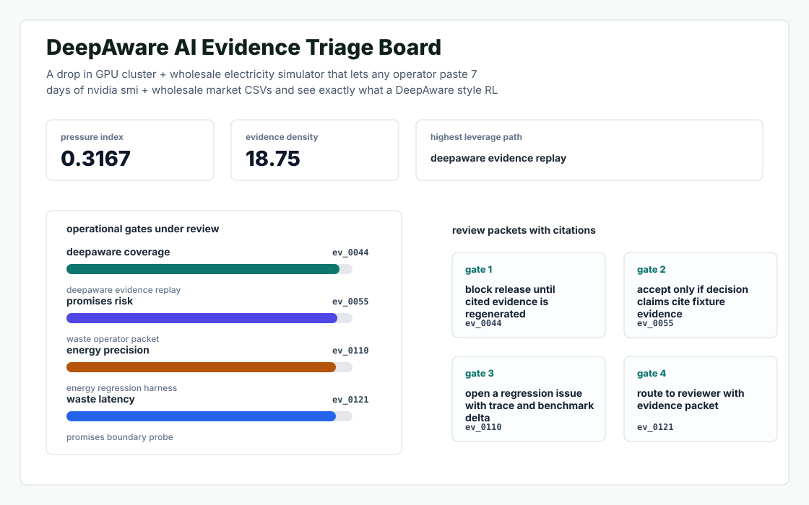
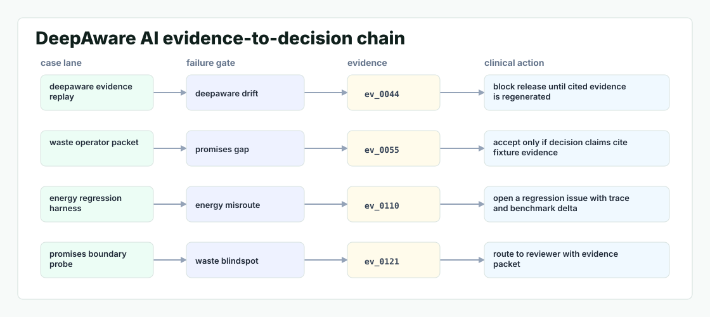

# Greenwatt Sim

A drop in GPU cluster + wholesale electricity simulator that lets any operator paste 7 days of nvidia smi + wholesale market CSVs and see exactly what a DeepAware style RL scheduler would have done — and saved — in their own facility.



## Why it exists

DeepAware promises a 30% energy waste cut and a 15% pilot validation, but the only public artifact backing those numbers is a single paragraph claim on the YC launch page. For a sales motion targeting mid market operators (who don't have Google's published TPU efficiency papers to lean on) the missing primitive is a reproducible, vendor neutral,.

The project is intentionally built as a local replay harness instead of a slide. It creates fixtures, plants realistic failure modes, produces citation-locked evidence, and turns the result into a dashboard a reviewer can inspect without credentials or hosted services.

## What is inside

- Deterministic fixture generation for the company-specific risk surface.
- Strategy code in `src/greenwatt_sim/strategy.py` with project-specific scoring and visual evidence.
- Citation-locked reports where every decision claim points to a generated evidence ID.
- Two regenerated visual artifacts: `outputs/project_working.svg` and `outputs/evidence_map.svg`.
- A portable demo pack with JSON, CSV, Markdown, HTML, SVG, benchmark, and test artifacts.



## Signals it measures

- `deepaware coverage`
- `promises risk`
- `energy precision`
- `waste latency`

## Failure modes it plants

- deepaware drift
- promises gap
- energy misroute
- waste blindspot

## Run it locally

```bash
uv sync
uv run greenwatt-sim all
uv run pytest -q
uv run ruff check .
```

## Outputs worth opening

- `outputs/dashboard.html`
- `outputs/project_working.svg`
- `outputs/evidence_map.svg`
- `outputs/operator_brief.md`
- `outputs/decision_report.md`
- `outputs/strategy_model.json`
- `outputs/demo_pack.zip`

## Boundary

Everything runs locally against synthetic fixtures. There are no credentials, no customer records, no outreach files, and no hosted API dependency.
